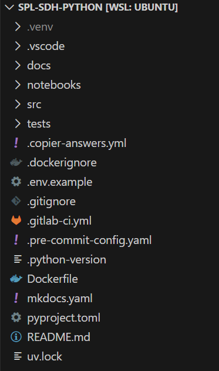

# Modern Python Project Template

A production-ready Python project template powered by **uv**.

This template provides a batteries-included setup with modern tooling, strict linting, automatic formatting, and CI/CD integration, all configured to work out of the box.

## ✨ Features

* **Package Manager:** [uv](https://github.com/astral-sh/uv) (blazing fast replacement for pip/poetry).
* **Linter & Formatter:** [Ruff](https://github.com/astral-sh/ruff) (configured for strict imports and formatting).
* **Pre-commit:** Automatic hooks to ensure code quality before every commit (optional).
* **Testing:** Pytest with configuration ready.
* **CI/CD:** CI pipelines for github, gitlab or bitbucket (optional).
* **Containerization:** Dockerfile included (optional).
* **Editor:** VS Code settings (extensions, tests, and linting) pre-configured.

## 📂 Project Structure

The template generates a clean, production-ready directory layout:

  

## 🛠️ Requirements

You **do not** need to install Python manually. The package manager `uv` handles Python versions automatically.

You only need:
1.  **Git**
2.  **uv**

### How to install uv

**On Linux / macOS:**

    curl -LsSf https://astral.sh/uv/install.sh | sh

**On Windows:**

    powershell -ExecutionPolicy ByPass -c "irm https://astral.sh/uv/install.ps1 | iex"

*More info on the [official website](https://docs.astral.sh/uv/getting-started/installation/#__tabbed_1_1).*

## 📦 Installation

This template is built with **Copier**. You can install Copier globally using `uv` (recommended).

**Important:** This template uses custom extensions. You must install Copier with the `copier-template-extensions` plugin.

    uv tool install copier --with copier-template-extensions

## 🚀 Usage

**Prerequisites:**
1.  Create a new repository (or folder) and open it in your terminal.
2.  **Ensure the folder is completely empty** (except for the `.git` folder if you cloned a new repository).

Run the generation command inside your empty folder:

    copier copy --trust https://github.com/Victor02091/template_python_project .

### Update values of an existing project
If you have already generated a project and want to change the current values, like updating python version:

    copier update --vcs-ref=:current: --trust --defaults --data python_version="3.13"

### Update template of an existing project
If you have already generated a project and want to pull the latest updates from the template:

    copier update --trust

