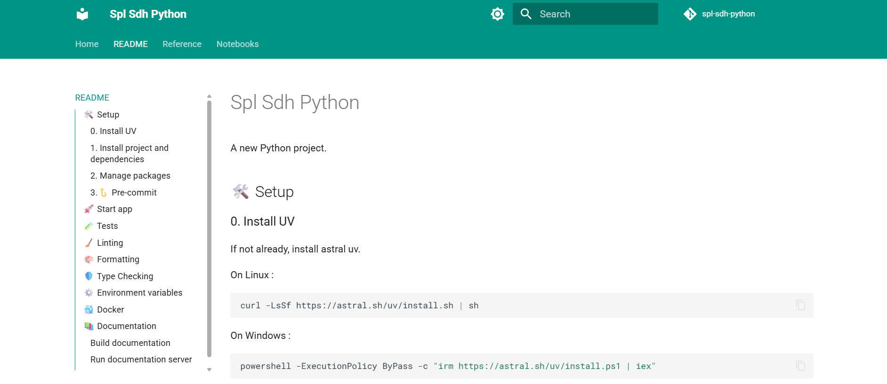
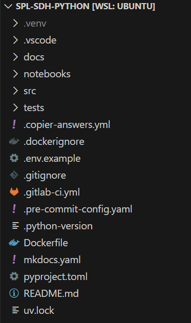

# Modern Python Project Template

A production-ready Python project template powered by **uv**.

This template provides a batteries-included setup with modern tooling, strict linting, automatic formatting, and CI/CD integration, all configured to work out of the box.

## ✨ Features

* **Package Manager:** [uv](https://github.com/astral-sh/uv) (blazing fast replacement for pip/poetry).
* **Linter & Formatter:** [Ruff](https://github.com/astral-sh/ruff) (configured for strict imports and formatting).
* **Type Checking:** Standard Mypy or new beta of astral [ty](https://github.com/astral-sh/ty) (optional).
* **Configuration:** [Pydantic Settings](https://docs.pydantic.dev/latest/concepts/pydantic_settings/) for type-safe environment variable management with validation.
* **Pre-commit:** Automatic hooks to ensure code quality before every commit (optional).
* **Testing:** Pytest with configuration ready.
* **CI/CD:** CI pipelines for github, gitlab or bitbucket (optional).
* **Containerization:** Dockerfile included (optional).
* **Editor:** VS Code settings (extensions, tests, and linting) pre-configured.
* **Documention:** Modern Mkdocs documentation (optional):

  

## 📂 Project Structure

The template generates a clean, production-ready directory layout:

  

## 🛠️ Requirements

You **do not** need to install Python manually. The package manager `uv` handles Python versions automatically.

You only need:
1.  **Git**
2.  **uv**

### How to install uv

**On Linux / macOS:**

    curl -LsSf https://astral.sh/uv/install.sh | sh

**On Windows:**

    powershell -ExecutionPolicy ByPass -c "irm https://astral.sh/uv/install.ps1 | iex"

*More info on the [official website](https://docs.astral.sh/uv/getting-started/installation/#__tabbed_1_1).*

## 📦 Installation

This template is built with **Copier**. You can install Copier globally using `uv` (recommended).

**Important:** This template uses custom extensions. You must install Copier with the `copier-template-extensions` plugin.

    uv tool install copier --with copier-template-extensions

## 🚀 Usage

**Prerequisites:**
1.  Create a new repository (or folder) and open it in your terminal.
2.  **Ensure the folder is completely empty** (except for the `.git` folder if you cloned a new repository).

Run the generation command inside your empty folder:

    copier copy --trust https://github.com/Victor02091/template_python_project .

### Update values of an existing project
If you have already generated a project and want to change the current values, like updating python version:

    copier update --vcs-ref=:current: --trust --defaults --data python_version="3.13"

### Update template of an existing project
If you have already generated a project and want to pull the latest updates from the template:

    copier update --trust

## 📋 Template Parameters

During generation, Copier will ask you a series of questions. Here is a quick reference for what each parameter controls:

### General Settings
* **`project_name`**: The human-readable name of your project. Used in the README and docs. *(Default: Current folder name)*
* **`project_slug`**: The importable Python package name (e.g., `src/my_package/`). Auto-slugified from the project name and used in `pyproject.toml` and Docker image tags.
* **`description`**: A short summary of what the project does. *(Default: "A new Python project.")*
* **`author_name`** & **`author_email`**: Package metadata injected into `pyproject.toml` and the README. *(Default: Your global git config)*
* **`python_version`**: Pins the Python version across the entire stack (`uv`, `.python-version`, Dockerfile, and CI/CD). *(Choices: 3.9 to 3.13 | Default: 3.12)*

### Features & Documentation
* **`add_docker`**: Generates a production-ready, multi-stage `Dockerfile` and `.dockerignore`. *(Default: true)*
* **`add_docs`**: Initializes an [MkDocs Material](https://squidfunk.github.io/mkdocs-material/) doc. Includes `mkdocstrings` lib for auto-generated references and enables stricter Ruff rules (`D101`, etc.) to enforce documented package. *(Default: true)*

### Tooling & CI/CD
* **`add_type_checking`**: Enables static type checking configuration, adding it to your CI pipeline and pre-commit hooks. *(Default: true)*
* **`type_checker`**: *(Condition: `add_type_checking` is true)*
  * `Mypy`: The standard, mature Python type checker. 
  * `Astral Ty`: The ultra-fast, modern Rust-based checker from the Astral team (currently in Beta).
* **`add_pre_commit`**: Generates a `.pre-commit-config.yaml` with Ruff and type-checker hooks to enforce code quality locally. *(Default: true)*
* **`add_ci`**: Generates a CI pipeline workflow that runs linting, type-checking, and tests (`pytest`) on every push. *(Default: true)*
* **`ci_provider`**: Selects the target CI platform (`Github Actions`, `GitLab CI`, or `Bitbucket Pipelines`). *(Condition: `add_ci` is true)*
* **`install_dependencies`**: Automatically runs `uv sync` to build the `.venv` immediately after generation. *(Default: true)*
* **`install_pre_commit_hooks`**: Automatically registers the git hooks in your local `.git` folder. *(Condition: pre-commit and dependencies are enabled)*